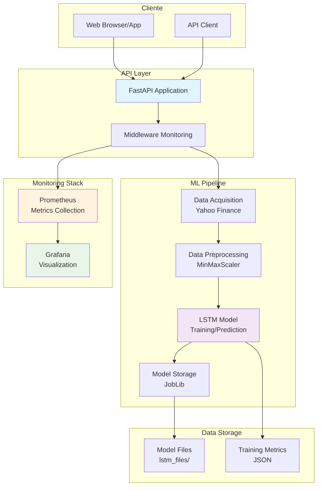
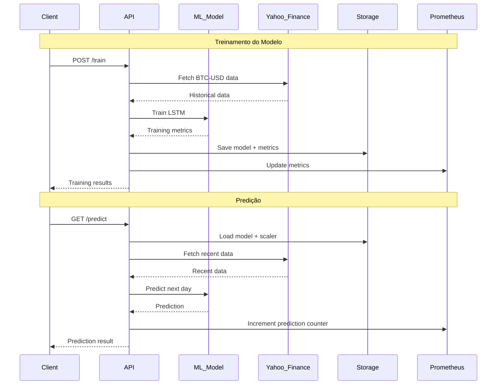
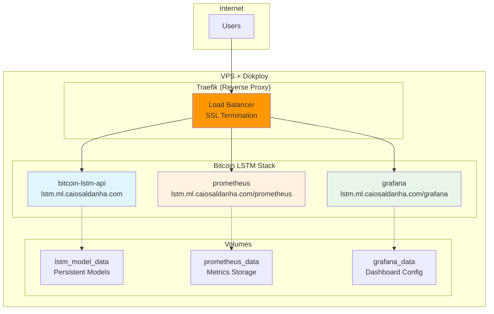
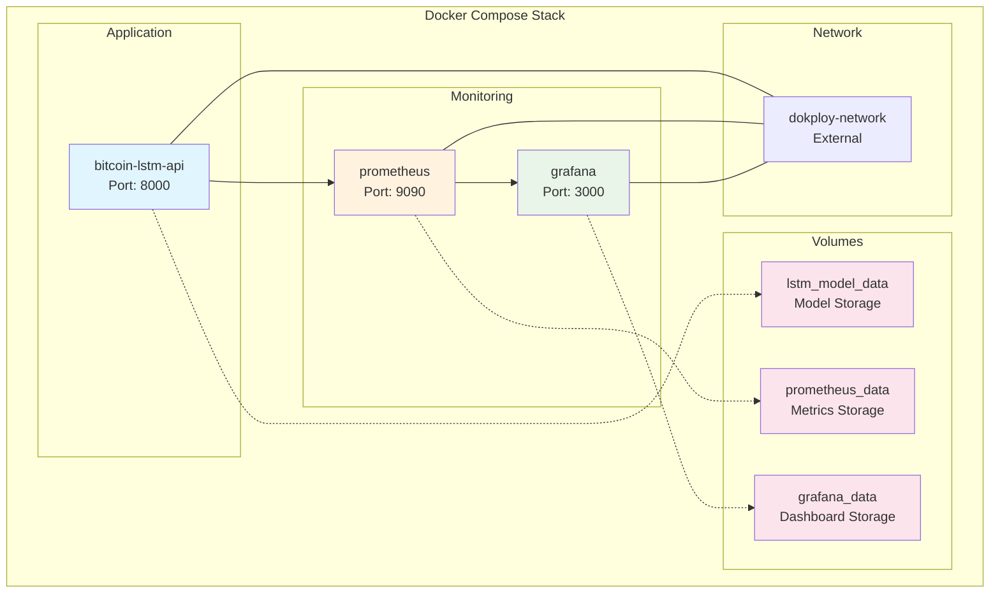
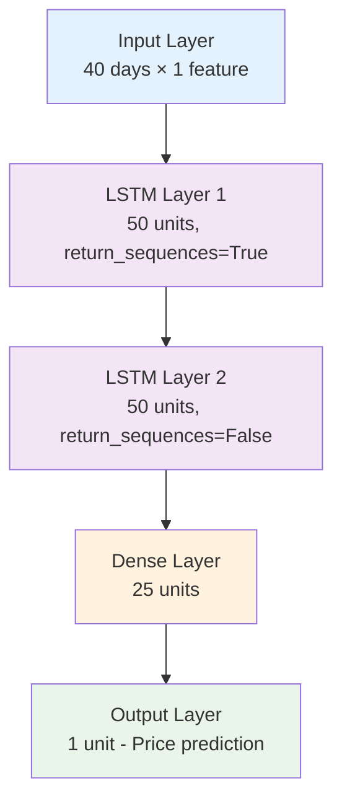
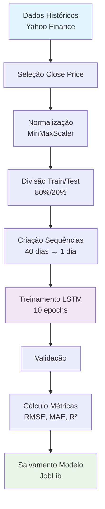

# 🚀 Bitcoin LSTM Predictor API

API FastAPI profissional para predição de preços de Bitcoin usando modelos LSTM com monitoramento completo e containerização Docker.

[](https://www.python.org/)
[](https://fastapi.tiangolo.com/)
[](https://docs.docker.com/compose/)
[](https://tensorflow.org/)
[](LICENSE)

## 📋 Índice

- [Visão Geral](#-visão-geral)
- [Arquitetura](#-arquitetura)
- [Funcionalidades](#-funcionalidades)
- [Tecnologias](#-tecnologias)
- [Instalação](#-instalação)
- [API Endpoints](#-api-endpoints)
- [Monitoramento](#-monitoramento)
- [Deploy com Docker](#-deploy-com-docker)
- [Desenvolvimento](#-desenvolvimento)
- [Exemplos de Uso](#-exemplos-de-uso)
- [Contribuição](#-contribuição)

## 🎯 Visão Geral

Este projeto implementa uma API REST completa para predição de preços de Bitcoin usando redes neurais LSTM (Long Short-Term Memory). A aplicação inclui treinamento de modelo, predições em tempo real, monitoramento de performance e métricas detalhadas.

### Características Principais

- **🤖 Modelo LSTM**: Rede neural recorrente para séries temporais
- **📊 Dados em Tempo Real**: Integração com Yahoo Finance
- **🔍 Monitoramento**: Prometheus + Grafana para observabilidade
- **🐳 Containerização**: Deploy completo com Docker Compose
- **📈 Métricas**: Avaliação detalhada do modelo (RMSE, MAE, R²)
- **🔄 API RESTful**: Endpoints bem documentados com FastAPI

## 🏗️ Arquitetura



### Fluxo de Dados



## ✨ Funcionalidades

### 🔧 API Core
- **Treinamento Automático**: Treina modelo LSTM com dados históricos desde 2018
- **Predições em Tempo Real**: Prediz preço do Bitcoin para o próximo dia
- **Avaliação de Modelo**: Métricas detalhadas de performance
- **Health Checks**: Verificação de saúde da aplicação

### 📊 Monitoramento
- **Métricas de Sistema**: CPU, memória, tempo de resposta
- **Métricas de ML**: Acurácia, número de predições, tempo de treinamento
- **Dashboards**: Visualização em tempo real com Grafana
- **Alertas**: Monitoramento proativo de performance

### 🐳 DevOps
- **Containerização**: Docker multi-stage build otimizado
- **Orquestração**: Docker Compose com todos os serviços
- **Volumes**: Persistência de dados e modelos
- **Networking**: Rede interna para comunicação entre serviços

## 🛠️ Tecnologias

### Backend & ML
- **FastAPI**: Framework web assíncrono
- **TensorFlow/Keras**: Deep learning framework
- **Pandas**: Manipulação de dados
- **NumPy**: Computação numérica
- **Scikit-learn**: Métricas e preprocessing
- **YFinance**: API financeira

### Monitoramento
- **Prometheus**: Coleta de métricas
- **Grafana**: Visualização de dados
- **Prometheus Client**: Métricas customizadas

### DevOps
- **Docker**: Containerização
- **Docker Compose**: Orquestração
- **Uvicorn**: Servidor ASGI

## 🚀 Instalação

### Opção 1: Deploy Produção (Dokploy + Traefik)

```bash
# Clone o repositório
git clone https://github.com/seu-usuario/bitcoin-lstm-predictor.git
cd bitcoin-lstm-predictor

# Deploy direto para produção
./run.sh deploy lstm.ml.caiosaldanha.com
```

**URLs de Produção:**
- **API**: https://lstm.ml.caiosaldanha.com
- **Docs**: https://lstm.ml.caiosaldanha.com/docs  
- **Grafana**: https://lstm.ml.caiosaldanha.com/grafana
- **Prometheus**: https://lstm.ml.caiosaldanha.com/prometheus

> 📖 **Veja [DEPLOY.md](DEPLOY.md) para instruções detalhadas de deploy no Dokploy**

### Opção 2: Docker Compose Local

```bash
# Clone o repositório
git clone https://github.com/seu-usuario/bitcoin-lstm-predictor.git
cd bitcoin-lstm-predictor

# Execute com Docker Compose
./run.sh start

# Ou manualmente
docker-compose up -d
```

### Opção 3: Ambiente Local

```bash
# Clone o repositório
git clone https://github.com/seu-usuario/bitcoin-lstm-predictor.git
cd bitcoin-lstm-predictor

# Crie ambiente virtual
python -m venv venv
source venv/bin/activate  # Linux/Mac
# ou
venv\Scripts\activate     # Windows

# Instale dependências
pip install -r requirements.txt

# Execute a aplicação
python main.py
```

## 📡 API Endpoints

### 🏠 Básicos

| Método | Endpoint | Descrição |
|--------|----------|-----------|
| `GET` | `/` | Status da API |
| `GET` | `/health` | Health check |
| `GET` | `/docs` | Documentação Swagger |

### 🤖 Machine Learning

| Método | Endpoint | Descrição | Resposta |
|--------|----------|-----------|----------|
| `POST` | `/train` | Treina o modelo LSTM | `TrainingResponse` |
| `GET` | `/predict` | Predição do próximo dia | `PredictionResponse` |
| `GET` | `/evaluate` | Métricas do modelo | `ModelEvaluationResponse` |
| `GET` | `/model-info` | Status do modelo | `ModelInfo` |

### 📊 Monitoramento

| Método | Endpoint | Descrição | Resposta |
|--------|----------|-----------|----------|
| `GET` | `/monitoring` | Informações de sistema | `MonitoringResponse` |
| `GET` | `/metrics` | Métricas Prometheus | `text/plain` |

### Exemplos de Resposta

#### POST /train
```json
{
  "message": "Modelo treinado e salvo com sucesso!",
  "rmse": 1234.56,
  "mae": 987.65,
  "r2": 0.95,
  "model_saved": true
}
```

#### GET /predict
```json
{
  "current_date": "2025-07-28",
  "next_day_prediction": 65432.10,
  "last_known_price": 64321.00
}
```

#### GET /evaluate
```json
{
  "model_exists": true,
  "training_date": "2025-07-28T10:30:00",
  "rmse": 1234.56,
  "mae": 987.65,
  "r2": 0.95,
  "training_duration": 120.5,
  "data_points_used": 2500
}
```

## 📈 Monitoramento

### Prometheus Metrics

A aplicação expõe as seguintes métricas:

- `bitcoin_lstm_requests_total`: Total de requisições
- `bitcoin_lstm_request_duration_seconds`: Duração das requisições
- `bitcoin_lstm_predictions_total`: Total de predições realizadas
- `bitcoin_lstm_training_duration_seconds`: Tempo de treinamento
- `bitcoin_lstm_cpu_usage_percent`: Uso de CPU
- `bitcoin_lstm_memory_usage_bytes`: Uso de memória
- `bitcoin_lstm_model_r2_score`: Score R² do modelo

### Grafana Dashboard

Acesse o dashboard em `http://localhost:3000`:
- **Usuário**: admin
- **Senha**: admin123

Métricas disponíveis:
- Taxa de requisições por segundo
- Tempo de resposta (percentis)
- Uso de CPU e memória
- Performance do modelo
- Número de predições

## 🐳 Deploy com Docker

### Deploy Produção (Dokploy + Traefik)



### Estrutura de Serviços



### Comandos Docker

```bash
# Deploy produção
./run.sh deploy [dominio]

# Build e start desenvolvimento
./run.sh start

# Ver logs
./run.sh logs

# Parar serviços
./run.sh stop

# Rebuild apenas a API
docker-compose up -d --build bitcoin-lstm-api

# Limpar volumes (CUIDADO: remove dados)
./run.sh clean
```

### Portas e Acessos

| Ambiente | Serviço | URL | Descrição |
|----------|---------|-----|-----------|
| **Produção** | API | https://lstm.ml.caiosaldanha.com | Aplicação principal |
| | Swagger | https://lstm.ml.caiosaldanha.com/docs | Documentação |
| | Prometheus | https://lstm.ml.caiosaldanha.com/prometheus | Métricas |
| | Grafana | https://lstm.ml.caiosaldanha.com/grafana | Dashboards |
| **Local** | API | http://localhost:8000 | Aplicação principal |
| | Swagger | http://localhost:8000/docs | Documentação |
| | Prometheus | http://localhost:9090 | Métricas |
| | Grafana | http://localhost:3000 | Dashboards |

## 👨‍💻 Desenvolvimento

### Estrutura do Projeto

```
bitcoin-lstm-predictor/
├── main.py                 # Aplicação FastAPI
├── requirements.txt        # Dependências Python
├── Dockerfile             # Container da aplicação
├── docker-compose.yml     # Orquestração
├── .dockerignore          # Arquivos ignorados no build
├── .gitignore             # Arquivos ignorados no git
├── README.md              # Documentação
├── lstm_files/            # Modelos treinados
│   ├── lstm_model.joblib
│   ├── scaler.joblib
│   └── training_metrics.json
└── monitoring/            # Configurações de monitoramento
    ├── prometheus.yml
    └── grafana/
        ├── datasources/
        │   └── prometheus.yml
        └── dashboards/
            ├── dashboard.yml
            └── bitcoin-lstm-dashboard.json
```

### Configuração de Desenvolvimento

```bash
# Instalar dependências de desenvolvimento
pip install -r requirements.txt

# Executar com hot reload
uvicorn main:app --reload --host 0.0.0.0 --port 8000

# Executar testes
python test_api.py

# Verificar código
black main.py
flake8 main.py
```

### Variáveis de Ambiente

```bash
# Configurações opcionais
export PYTHONUNBUFFERED=1
export TF_CPP_MIN_LOG_LEVEL=2  # Reduzir logs TensorFlow
```

## 📖 Exemplos de Uso

### Usando cURL

```bash
# 1. Verificar status
curl http://localhost:8000/

# 2. Treinar modelo
curl -X POST http://localhost:8000/train

# 3. Fazer predição
curl http://localhost:8000/predict

# 4. Ver métricas do modelo
curl http://localhost:8000/evaluate

# 5. Monitoramento
curl http://localhost:8000/monitoring
```

### Usando Python

```python
import requests
import json

BASE_URL = "http://localhost:8000"

# Treinar modelo
response = requests.post(f"{BASE_URL}/train")
print(json.dumps(response.json(), indent=2))

# Fazer predição
response = requests.get(f"{BASE_URL}/predict")
prediction = response.json()

print(f"Preço atual: ${prediction['last_known_price']:.2f}")
print(f"Predição: ${prediction['next_day_prediction']:.2f}")

# Calcular variação
change = prediction['next_day_prediction'] - prediction['last_known_price']
change_pct = (change / prediction['last_known_price']) * 100
print(f"Variação esperada: {change_pct:+.2f}%")
```

### Usando JavaScript/Node.js

```javascript
const axios = require('axios');

const BASE_URL = 'http://localhost:8000';

async function trainModel() {
  try {
    const response = await axios.post(`${BASE_URL}/train`);
    console.log('Modelo treinado:', response.data);
  } catch (error) {
    console.error('Erro no treinamento:', error.response.data);
  }
}

async function getPrediction() {
  try {
    const response = await axios.get(`${BASE_URL}/predict`);
    const prediction = response.data;
    
    console.log(`Preço atual: $${prediction.last_known_price}`);
    console.log(`Predição: $${prediction.next_day_prediction}`);
    
    const change = prediction.next_day_prediction - prediction.last_known_price;
    const changePct = (change / prediction.last_known_price) * 100;
    console.log(`Variação: ${changePct > 0 ? '+' : ''}${changePct.toFixed(2)}%`);
  } catch (error) {
    console.error('Erro na predição:', error.response.data);
  }
}

// Executar
trainModel().then(() => getPrediction());
```

## 🤖 Detalhes do Modelo LSTM

### Arquitetura



### Características do Modelo

- **Janela de Entrada**: 40 dias de preços históricos
- **Camadas LSTM**: 2 camadas com 50 unidades cada
- **Ativação**: Padrão (tanh)
- **Otimizador**: Adam
- **Loss Function**: Mean Squared Error
- **Normalização**: MinMaxScaler (0-1)

### Pipeline de Treinamento



## 🔍 Métricas de Avaliação

### RMSE (Root Mean Square Error)
- Mede a diferença quadrática média entre valores preditos e reais
- **Interpretação**: Menor valor = melhor performance
- **Unidade**: Mesma unidade do target (USD)

### MAE (Mean Absolute Error)
- Mede a diferença absoluta média
- **Interpretação**: Menor valor = melhor performance  
- **Vantagem**: Menos sensível a outliers que RMSE

### R² Score (Coefficient of Determination)
- Mede a proporção da variância explicada pelo modelo
- **Range**: 0 a 1 (1 = perfeito, 0 = ruim)
- **Interpretação**: Maior valor = melhor performance

## 🚨 Troubleshooting

### Problemas Comuns

#### 1. Erro de Memória durante Treinamento
```bash
# Solução: Reduzir batch_size
# Em main.py, linha ~177
history = model.fit(x_train, y_train, validation_split=0.2, batch_size=2, epochs=10, verbose=0)
```

#### 2. Erro de Conexão com Yahoo Finance
```bash
# Verificar conectividade
curl -I https://finance.yahoo.com

# Aguardar e tentar novamente
sleep 60 && curl -X POST http://localhost:8000/train
```

#### 3. Container não inicia
```bash
# Verificar logs
docker-compose logs bitcoin-lstm-api

# Rebuild clean
docker-compose down
docker system prune -f
docker-compose up -d --build
```

#### 4. Grafana sem dados
```bash
# Verificar Prometheus targets
curl http://localhost:9090/api/v1/targets

# Restart stack
docker-compose restart
```

### Logs e Debug

```bash
# Ver logs da aplicação
docker-compose logs -f bitcoin-lstm-api

# Logs do Prometheus  
docker-compose logs -f prometheus

# Logs do Grafana
docker-compose logs -f grafana

# Executar comandos no container
docker-compose exec bitcoin-lstm-api bash
```

## 🤝 Contribuição

### Como Contribuir

1. **Fork** o projeto
2. **Clone** seu fork
3. **Crie** uma branch para sua feature
4. **Commit** suas mudanças
5. **Push** para a branch
6. **Abra** um Pull Request

```bash
# Exemplo de workflow
git clone https://github.com/seu-usuario/bitcoin-lstm-predictor.git
cd bitcoin-lstm-predictor
git checkout -b feature/nova-funcionalidade
git commit -m "Adiciona nova funcionalidade"
git push origin feature/nova-funcionalidade
```

### Padrões de Código

- **Python**: PEP 8
- **Commits**: Conventional Commits
- **Documentation**: Docstrings + Type Hints
- **Testing**: Pytest para testes automatizados

### Roadmap

- [ ] Suporte a múltiplas criptomoedas
- [ ] Modelo ensemble (LSTM + GRU + Transformer)
- [ ] API de backtesting
- [ ] Interface web React
- [ ] Deploy em Kubernetes
- [ ] CI/CD com GitHub Actions
- [ ] Alertas automáticos por email/slack

## 📄 Licença

Este projeto está licenciado sob a MIT License - veja o arquivo [LICENSE](LICENSE) para detalhes.

## 📞 Suporte

- **Email**: hello@caiosaldanha.com

---

⭐ **Se este projeto foi útil, considere dar uma estrela no GitHub!**

Desenvolvido com ❤️ usando FastAPI, TensorFlow e Docker.
